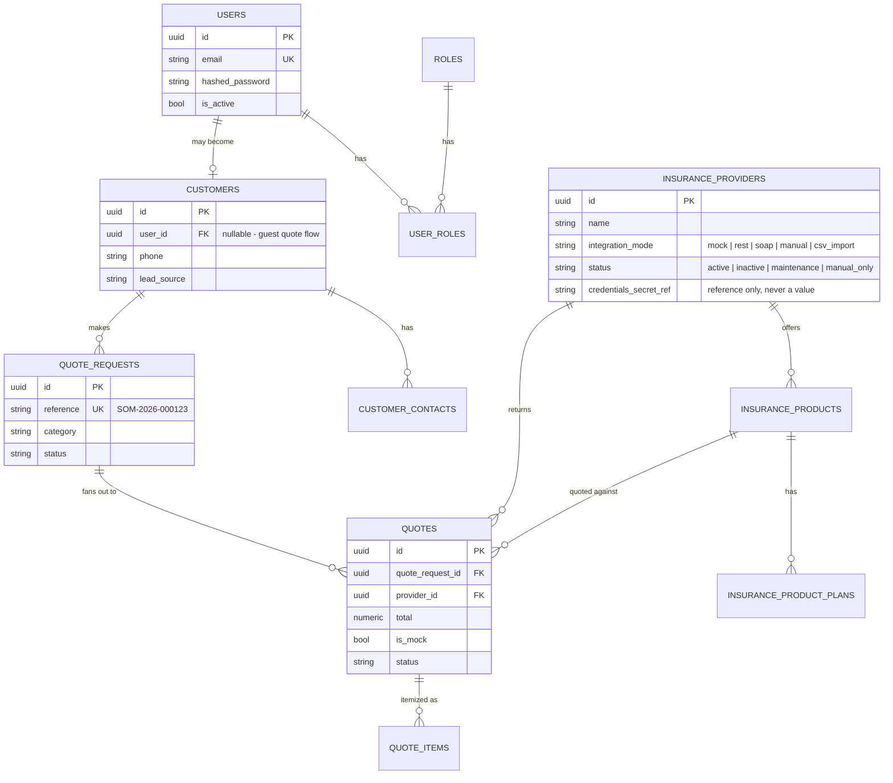

# Data Model - Phase 1

Tables actually created by migration `0001_initial_foundation`. The rest of
the spec §31 table list (policies, payments, claims, renewals, stickers,
financing, leads, communications, content, automation, audit_logs, ...) is
designed conceptually in the roadmap but not yet migrated - adding them
alongside their first real feature keeps the schema honest about what's
actually wired up.

## Notes

- `credentials_secret_ref` on `insurance_providers` stores a *name*, not a
  value - the actual secret is resolved from the environment/secret manager
  at call time and never leaves the backend process (spec §23, §30).
- `quotes.is_mock` is `true` for every row until a real adapter replaces
  `MockProvider` for that insurer - this flag should propagate to every API
  response and UI surface that shows a quote.
- `quote_requests.reference` uses the `SOM-YYYY-NNNNNN` format from spec §6.
